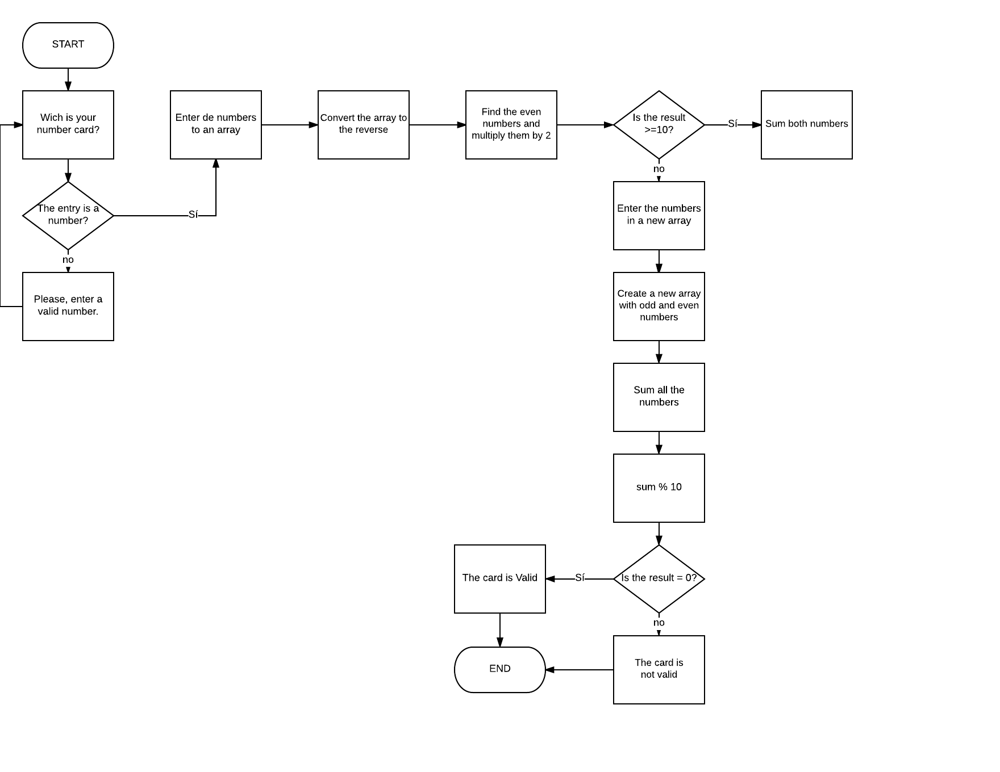

# Pseudocódigo

1. Ask for the card number with a prompt.
2. Convert the contents of the prompt from string to number and save the result in a variable.
3. Enter the number in an array.
4. Take the array and divide the numbers one by one to generate a new arrangement.
5. Take the new array and put it with the numbers upside down.
6. Find the even numbers of the array and multiply them by 2.
	6.1 If the result is > = 10, sum the numbers.
7. Make a new arrany where we place the odd numbers + the new numbers in the even positions.
8. Sum each of the numbers and divide them by 10
9. f the module of the result is 0 the card is valid, otherwise it will be invalid.
10. End
 
 